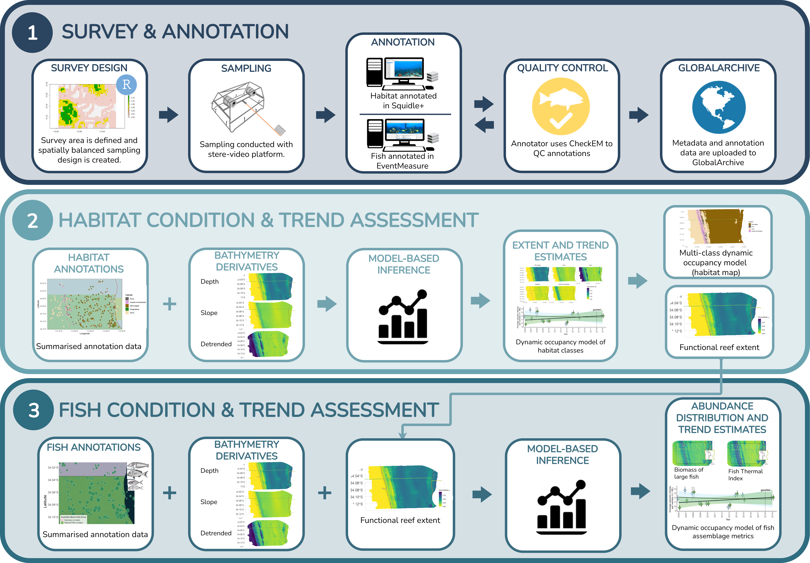

# Australian Marine Parks

### Geographe Marine Park 
- [Appendix A - Natural Values Report](quartos/geographe/Project%204.21-Geographe-2-Appendix%20A-q-Natural%20values.html)
- [Appendix B - Pressures Report (to add)](quartos/geographe/Project%204.21-Geographe-2-Appendix%20A-q-Natural%20values.html)
- [Appendix C - Data Analysis Report (to add)](quartos/geographe/Project%204.21-Geographe-2-Appendix%20A-q-Natural%20values.html)

### Eastern Recherche Marine Park 
- [Appendix A - Natural Values Report](quartos/eastern-recherche/Project%204.21-Eastern%20Recherche-2-Appendix%20A-q-Natural%20values.html)
- [Appendix B - Pressures Report (to add)](quartos/geographe/Project%204.21-Geographe-2-Appendix%20A-q-Natural%20values.html)
- [Appendix C - Pressures Report (to add)](quartos/geographe/Project%204.21-Geographe-2-Appendix%20A-q-Natural%20values.html)

### South-west Corner Marine Park (Eastern Arm)
- [Appendix A - Natural Values Report](quartos/swc_easternarm/Project%204.21-Swc_easternarm-2-Appendix%20A-q-Natural%20values.html)
- [Appendix B - Pressures Report (to add)](quartos/geographe/Project%204.21-Geographe-2-Appendix%20A-q-Natural%20values.html)
- [Appendix C - Data Analysis Report (to add)](quartos/geographe/Project%204.21-Geographe-2-Appendix%20A-q-Natural%20values.html)

### Abrolhos Marine Park (Clio Bank)
- [Appendix A - Natural Values Report](quartos/abrolhos_clio-bank/Project%204.21-Abrolhos-Clio-Bank-Appendix%20A-q-Natural%20values.html)
- [Appendix B - Pressures Report (to add)](quartos/geographe/Project%204.21-Geographe-2-Appendix%20A-q-Natural%20values.html)
- [Appendix C - Data Analysis Report (to add)](quartos/geographe/Project%204.21-Geographe-2-Appendix%20A-q-Natural%20values.html)
